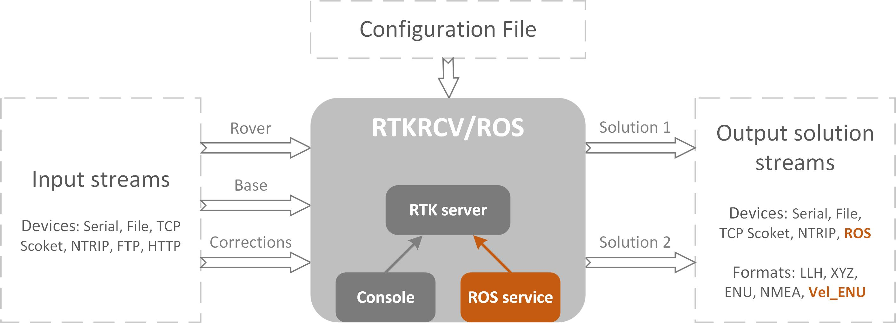

# RTKRCV_ROS

This package provides a translation of the RTKRCV to the ROS environment. The RTKRCV, part of the RTKLIB suite, is a standalone command line application for real-time GNSS precise positioning. The RTKRCV_ROS incorporates ROS features seamlessly, to not intefere with the operating mode and configuration options of the original RTKRCV.

The RTKRCV_ROS includes ROS output publishing, a new velocity output format, ROS service control over the RTK server and a new observation synchronization method. All configurations are made through the configuration file. Several configuration file examples are provided.

[RTKLIB](http://www.rtklib.com/) was originally developed by [Tomoji Takasu](https://github.com/tomojitakasu)

---
    
### Paper
[For additional details please refer to this article](https://doi.org/10.1177/1729881420904526)

### Version
The current version is based on RTKLIB 2.4.2 p13, tested in ROS Kinetic

### Author
António Ferreira (ajbf@inesctec.pt) - INESC TEC - Portugal 

### License
This project is distributed under the [BSD 2-clause license](LICENSE).
